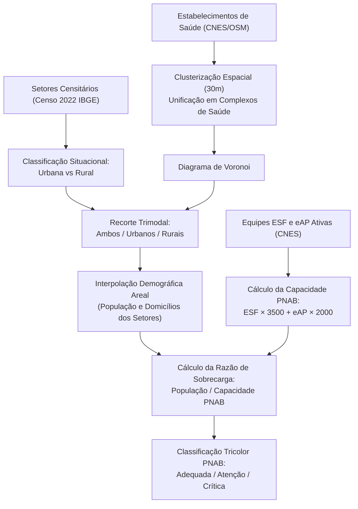

# Justificativa Metodológica: O Uso de Polígonos de Voronoi Ponderados como Proxy para as Áreas de Abrangência das UBS no Brasil

> **Documento Técnico de Referência — Plataforma DEMAS**  
> *Data de Publicação:* Setembro de 2026  
> *Autores:* Projeto DEMAS (Data Extraction & Municipal Analysis of Sanitation and Health)  
> *Status:* Metodologia Oficial de Modelagem Espacial de Cobertura da APS & PNAB

---

## 1. Sumário Executivo

Na Atenção Primária à Saúde (APS) brasileira, cada Unidade Básica de Saúde (UBS) é idealmente responsável por um conjunto determinado de famílias e domicílios distribuídos em um território geográfico específico, denominado **território adstrito** ou **área de abrangência**.

No entanto, **não existe no Brasil uma base de dados cartográfica nacional unificada contendo os polígonos reais das áreas atendidas pelas UBS**. 

Diante dessa lacuna institucional e da necessidade de analisar o acesso geográfico e a sobrecarga populacional da APS para todos os **5.571 municípios brasileiros**, a plataforma DEMAS emprega **Diagramas de Voronoi (Thiessen)** intersectados com as manchas urbanas e rurais do **Censo Demográfico 2022 (IBGE)** e ponderados pela capacidade de atendimento das equipes da **Política Nacional de Atenção Básica (PNAB)**.

Este documento detalha as razões técnicas, políticas e institucionais que justificam o uso dessa abordagem como o *padrão ouro* na literatura científica de Saúde Coletiva e Geoprocessamento em Saúde.

---

## 2. A Territorialização na Atenção Primária: O Conceito de Território Vivo

A Política Nacional de Atenção Básica (PNAB — Portaria de Consolidação GM/MS nº 2/2017) estabelece a **territorialização** e a **adscrição de clientela** como diretrizes estruturantes do Sistema Único de Saúde (SUS):

* **Território Adstrito:** Área geográfica contínua e delimitada, sob responsabilidade sanitária de uma ou mais Equipes de Saúde da Família (eSF) e Equipes de Atenção Primária (eAP) vinculadas a uma UBS.
* **Microáreas:** Subdivisões territoriais do território adstrito, sob acompanhamento direto de um Agente Comunitário de Saúde (ACS), contendo historicamente até 750 pessoas.
* **Território Vivo:** Mais do que uma fronteira geométrica rígida, o território na saúde pública compreende dinâmicas sociais, fluxos de transporte, barreiras naturais (relevo, hidrografia), barreiras artificiais (rodovias, linhas férreas) e barreiras psicossociais (fronteiras invisíveis de violência urbana e vulnerabilidade).

Em um modelo ideal de planejamento, cada cidadão brasileiro pertenceria ao polígono exato de uma microárea de ACS e à área de abrangência de sua respectiva UBS.

---

## 3. Por que não existe uma malha vetorial nacional de áreas de UBS?

Uma pesquisa aprofundada nos repositórios federais e sistemas de informação em saúde revela que a ausência de uma base nacional de polígonos decorre de quatro fatores estruturais:

### 3.1. Descentralização e Autonomia Constitucional Municipal
Pelo pacto federativo do SUS, a gestão da Atenção Básica é **plenamente municipalizada**. Cabe exclusivamente às Secretarias Municipais de Saúde (SMS) definir, criar, alterar e remanejar os perímetros de atendimento de suas unidades. O Ministério da Saúde atua no financiamento, normatização geral e monitoramento de indicadores de produção, **sem poder de ingerência na cartografia microurbana** de cada cidade.

### 3.2. Natureza Dinâmica dos Territórios de Saúde
O território de uma UBS é sujeito a reconfigurações frequentes:
* Abertura de novos loteamentos e conjuntos habitacionais.
* Desmembramento ou unificação de microáreas após a contratação de novos ACS.
* Construção ou reforma de novas unidades e remanejamento provisório de equipes.
Manter um repositório nacional contínuo atualizado exigiria um fluxo cartográfico diário de 5.571 secretarias municipais de saúde, o que atualmente inexiste no Brasil.

### 3.3. O Abismo de Capacidade Técnica e Geoprocessamento Municipal
Dos 5.571 municípios brasileiros:
* **Menos de 10%** contam com equipes dedicadas de Geoprocessamento, Sistemas de Informação Geográfica (SIG) ou Infraestruturas de Dados Espaciais (IDE) institucionais.
* Na esmagadora maioria dos municípios pequenos e médios (especialmente aqueles com menos de 50.000 habitantes), as "áreas de abrangência" existem apenas sob a forma de **listagens em texto de bairros e ruas em decretos municipais**, ou em **mapas conceituais desenhados à mão** afixados nas paredes das próprias unidades.

### 3.4. As Limitações dos Sistemas Nacionais Existentes
* **CNES (Cadastro Nacional de Estabelecimentos de Saúde):** Cadastra os estabelecimentos de saúde exclusivamente como **pontos (latitude e longitude)**, sem registrar as geometrias das áreas de cobertura.
* **e-SUS APS / SISAB:** O prontuário eletrônico e o aplicativo *e-SUS Território* (utilizado pelos ACS em campo) operam com cadastros domiciliares e individuais (endereço com CEP, logradouro e número). Esses dados são agregados de forma puramente tabular no Sistema de Informação em Saúde para a Atenção Básica (SISAB), sem gerar ou disponibilizar uma malha vetorial pública de polígonos.
* **INDE (Infraestrutura Nacional de Dados Espaciais):** Centraliza camadas cartográficas ambientais, censitárias, fundiárias e de transporte, mas não possui catálogo de setores de atenção primária à saúde.

---

## 4. Onde os Polígonos Reais Existem? (Geoportais das Grandes Cidades)

Embora não haja centralização federal, capitais e grandes centros urbanos que investiram em Infraestruturas de Dados Espaciais municipais publicam suas malhas oficiais de áreas de abrangência para download público:

| Município | Portal Oficial / IDE | Camada Disponível | Formatos |
| :--- | :--- | :--- | :--- |
| **São Paulo (SP)** | [GeoSampa](https://geosampa.prefeitura.sp.gov.br/) | *Área de Abrangência de Unidades Básicas de Saúde (GISA / SMS-SP)* | Shapefile, KML, WFS |
| **Belo Horizonte (MG)** | [BH Map (IDE-BHGeo)](http://bhmap.pbh.gov.br/) | *Área de Abrangência Saúde* | Shapefile, GeoJSON, WFS |
| **Rio de Janeiro (RJ)** | [Data.Rio](https://data.rio/) | *Áreas de Atuação das Clínicas da Família / CMS* | Shapefile, GeoJSON, CSV |
| **Curitiba (PR)** | [GeoCuritiba (IPPUC)](https://www.ippuc.org.br/) | *Áreas de Abrangência das Unidades de Saúde (US)* | Shapefile, WFS |
| **Porto Alegre (RS)** | [GeoSaúde / Mapas Digitais Poa](https://prefeitura.poa.br/smamus/mapas-digitais) | *Gerências Distritais e Cobertura da Atenção Primária* | Shapefile, KMZ |
| **Recife (PE)** | [Portal de Dados Abertos do Recife](http://dados.recife.pe.gov.br/) | *Unidades de Saúde e Microrregiões Sanitárias* | GeoJSON, Shapefile |
| **Campinas (SP)** | [Geoportal Campinas](https://geo.campinas.sp.gov.br/) | *Áreas de Abrangência dos Centros de Saúde* | Shapefile, WFS |

Para esses municípios específicos, os dados reais refletem o histórico administrativo e as barreiras físicas urbanas locais.

---

## 5. Fundamentação Teórico-Científica do Diagrama de Voronoi na Literatura

Diante da inexistência de polígonos reais para mais de 5.000 cidades, a literatura científica nacional e internacional adota os **Diagramas de Voronoi (também conhecidos como Polígonos de Thiessen)** como o modelo matemático de referência.

Estudos seminais publicados na Fundação Oswaldo Cruz (**Fiocruz**), Instituto de Pesquisa Econômica Aplicada (**IPEA**), e periódicos como *Cadernos de Saúde Pública* e *Revista de Saúde Pública* destacam:

> *"O método de partição territorial de Voronoi gera células de proximidade onde qualquer ponto no interior do polígono está mais próximo daquela instalação do que de qualquer outra. Trata-se de um instrumento analítico consagrado para estimar bacias de atração populacional na ausência de limites administrativos digitais."*

### Por que o Voronoi se destaca?
1. **Princípio da Menor Distância e Esforço:** A PNAB preconiza a acessibilidade geográfica de primeiro contato; o Voronoi modela a escolha do usuário pela unidade de saúde mais próxima de sua residência.
2. **Cobertura Territorial Contígua e Exaustiva:** Ao contrário de buffers circulares (raios de 1 km ou 2 km), que geram sobreposições artificiais e deixam "vazios" entre as unidades, as células de Voronoi particionam 100% do território do município sem sobreposições e sem lacunas.
3. **Imparcialidade e Reprodutibilidade:** Fornece um critério objetivo e geometricamente reprodutível para comparar equidade de cobertura em escala nacional (5.571 municípios).

---

## 6. A Metodologia Avançada do DEMAS

O DEMAS não utiliza apenas um Voronoi clássico elementar. Para mitigar distorções e aproximar a análise ao máximo da realidade do SUS, foram implementadas quatro inovações metodológicas:

### 6.1. Clusterização de Proximidade (30 metros)
Unidades de saúde contíguas ou dividindo o mesmo terreno (como uma UBS tradicional e uma Academia da Saúde ou um Centro de Especialidades Odontológicas) são unificadas em um único **Polo de Saúde Complexado**, agregando todas as suas equipes ESF e eAP e prevenindo a geração de microcélulas colapsadas.

### 6.2. Recorte Trimodal: Ambos, Urbanos e Rurais
* **Modo `ambos`:** Voronoi clipado pelo contorno do município, capturando a continuidade espacial total.
* **Modo `urbanos`:** Voronoi clipado estritamente pela união dos setores censitários urbanos de quadra e loteamento do Censo 2022, isolando as dinâmicas de bairros e favelas.
* **Modo `rurais`:** Voronoi clipado pela união dos setores censitários rurais e florestais, modelando as áreas de campo e sertão com respeito às barreiras geográficas.

### 6.3. Ponderação pela Capacidade Efetiva da PNAB
Cada célula de Voronoi recebe a capacidade populacional somada das equipes ativas no polo:
$$\text{Capacidade PNAB} = (N_{\text{ESF}} \times 3.500) + (N_{\text{eAP}} \times 2.000)$$
A população censitária real do Censo 2022 incidente sobre a célula é calculada por **interpolação areal de sobreposição geométrica**, permitindo classificar objetivamente a **razão de sobrecarga**:
* **Verde (Adequada):** Sobrecarga $\le 100\%$ da capacidade PNAB.
* **Amarelo (Atenção):** Sobrecarga entre $100\%$ e $150\%$.
* **Vermelho (Crítica):** Sobrecarga $> 150\%$ da capacidade recomendada.

---

## 7. Roteiro Futuro: Arquitetura Híbrida do DEMAS

A arquitetura do pipeline DEMAS foi construída em módulos desacoplados para viabilizar, em fases futuras, uma **abordagem híbrida**:

1. **Camada Override (Polígonos Reais):** Para municípios com Infraestruturas de Dados Espaciais públicas e estáveis (como São Paulo, Curitiba, Belo Horizonte e Rio de Janeiro), o pipeline poderá integrar os conectores WFS/GeoJSON específicos dessas prefeituras para substituir a malha teórica pela malha oficial da SMS.
2. **Camada Proxy (Voronoi Ponderado):** Para os mais de 5.500 municípios onde as secretarias municipais não publicam malhas cartográficas vetoriais, o Voronoi trimodal continuará servindo como o estimador analítico oficial e rigoroso da cobertura da APS.

---

## 8. Referências Bibliográficas e Documentos Oficiais

1. **BRASIL. Ministério da Saúde.** Portaria de Consolidação nº 2/GM/MS, de 28 de setembro de 2017. *Aprova a Política Nacional de Atenção Básica (PNAB)*. Brasília: Ministério da Saúde, 2017.
2. **IBGE.** *Censo Demográfico 2022: Agregados por Setores Censitários — Malha de Setores com Atributos*. Rio de Janeiro: Instituto Brasileiro de Geografia e Estatística, 2024.
3. **FIOCRUZ.** *Território e Saúde: Metodologias e Abordagens Geoespaciais para o SUS*. Cadernos de Saúde Pública / ICICT, Rio de Janeiro, 2020.
4. **IPEA.** *Acessibilidade Espacial a Serviços de Saúde no Brasil: Metodologia e Estimativas Nacionais*. Texto para Discussão, Instituto de Pesquisa Econômica Aplicada, Brasília, 2021.
5. **PREFEITURA DO MUNICÍPIO DE SÃO PAULO.** *Geosampa: Mapa Digital da Cidade de São Paulo — Camadas de Saúde e Áreas de Abrangência*. Secretaria Municipal de Urbanismo e Licenciamento / SMS-SP, 2024. Disponível em: <https://geosampa.prefeitura.sp.gov.br/>.
6. **PBH.** *IDE-BHGeo: Infraestrutura de Dados Espaciais de Belo Horizonte — Camadas de Saúde*. Prefeitura Municipal de Belo Horizonte, 2024. Disponível em: <http://bhmap.pbh.gov.br/>.
7. **IPPUC.** *GeoCuritiba: Sistema de Informações Geográficas de Curitiba*. Instituto de Pesquisa e Planejamento Urbano de Curitiba, 2024. Disponível em: <https://www.ippuc.org.br/>.
